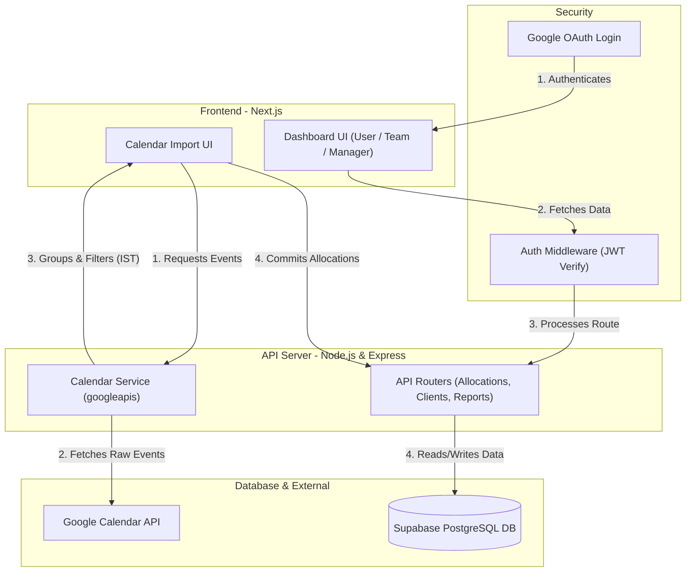

# 🚀 MavsTracker — Time Allocation & Analytics Platform

[](https://nodejs.org/)
[](https://nextjs.org/)
[](https://supabase.com/)
[](https://www.typescriptlang.org/)
[](https://expressjs.com/)

An enterprise-grade, high-performance time-tracking and productivity analytics platform designed for teams to easily log hours, fetch Google Calendar meetings in real-time, and analyze resource allocations across projects and clients.

---

## 🌟 Key Features

*   📅 **Google Calendar Integration:** Automatically import, group, and log meeting hours directly from Google Calendar, skipping duplicate logs and auto-calculating durations.
*   📊 **Interactive Dashboards:** Distinct dashboards for **Core Team Members**, **Managers**, and **Super Admins** containing real-time total logs, projections, and monthly client targets.
*   ⚡ **Searchable Dropdowns:** Ultra-responsive searchable select dropdowns for rosters and clients with horizontal auto-fitting and overflow prevention.
*   🔒 **Google OAuth Security:** Secure corporate access restricted to official domains.
*   🗄️ **Relational DB Power:** Backed by a high-availability Supabase PostgreSQL database holding records, roles, client budgets, and direct team reporting lines.

---

## 🗺️ System Flow & Architecture

This flowchart illustrates how the frontend, Express backend, Google Ecosystem, and Supabase Database interact seamlessly in real-time:



---

## 📂 Project Structure

```text
Time-Allocation-Project/
├── client/                     # Next.js (Frontend Client App)
│   ├── src/
│   │   ├── app/                # Next.js Pages (Dashboard, Manager, Core, Team)
│   │   ├── components/         # SearchableSelect, MemberInsights, Sidebar, ClientAdmin
│   │   ├── hooks/              # useAllocations custom reactive state handlers
│   │   └── lib/                # Supabase configurations and Client APIs
│   ├── package.json
│   └── tsconfig.json
├── server/                     # Node.js + Express (Backend API Server)
│   ├── src/
│   │   ├── config/             # Supabase credentials initialization
│   │   ├── controllers/        # Business Logic (allocations, teams, reports, clients)
│   │   ├── middleware/         # Security & JWT Authentication checks
│   │   ├── routes/             # REST endpoints (router mappings)
│   │   └── services/           # Google Calendar Service integrations
│   ├── package.json
│   └── tsconfig.json
├── code.gs                     # Google Apps Script Utility (Calendar sync automation)
├── supabase_schema.sql         # SQL Database Schema & RLS Policies
└── seed_production.js          # Direct DB Seeding tool
```

---

## 🗃️ Database Architecture & Schema

MavsTracker is engineered on top of a highly optimized PostgreSQL relational schema in Supabase with foreign keys enforcing absolute data integrity:

### 1. Core Tables
*   **`users`**: Represents company employees. Holds Google sub IDs, emails, names, profile pictures, and active role scopes (`team`, `manager`, `core`).
*   **`teams`**: Represents corporate reporting lines. Maps a `manager_id` (pointing to `users`) to a `member_id` (pointing to `users`) uniquely.
*   **`clients`**: Represents active corporate accounts, their details, and their designated `core_owner` who oversees operations.
*   **`allocations_weekly` (Actuals)**: Stores historical weekly work logs with hours, notes, exact `start_date`, `end_date`, and a unique `week_code` (e.g., `2025-11-Wk1`).
*   **`allocations_monthly` (Projections)**: Stores month-by-month client effort allocations planned/projected in advance.

### 2. Row Level Security (RLS) Policies
The database has ironclad security policies active, preventing malicious or cross-tenant operations:
*   **Own Data Access:** Employees can read, update, and manage only their own weekly and monthly allocations (`auth.uid() = user_id`).
*   **Manager Access:** Managers can dynamically view allocations from members reporting directly to them in the `teams` mapping:
    ```sql
    EXISTS (SELECT 1 FROM teams WHERE teams.manager_id = auth.uid() AND teams.member_id = allocations_weekly.user_id)
    ```
*   **Core Access:** Core members/admins bypass restrictions and possess global read access over all client allocations and client settings.

---

## 📅 Google Calendar Sync Engine

The calendar integration in MavsTracker goes far beyond basic event loading. It includes a custom grouping and processing engine:

1.  **IST Grouping & Time Parsing:** Dates are parsed and queried matching India Standard Time (IST).
2.  **Decimal Hour Calculation:** Converts calendar durations seamlessly into decimal hours (e.g., a 45-minute standup is converted into exactly `0.75` hours).
3.  **Smart Deduplication:** Groups identical events occurring on the same day by title and date to prevent dashboard clutter.
4.  **Auto-Mapping:** Groups events matching your client roster titles, pre-filling categories, client targets, and notes for the user automatically.

---

## ⚙️ Environment Configurations

Create your environment configuration files locally. These files are strictly locked out of Git for security:

### Server configuration: `server/.env`
```ini
PORT=5000
NODE_ENV=production

# Supabase Database Keys
SUPABASE_URL=https://your-project.supabase.co
SUPABASE_SERVICE_ROLE_KEY=your-supabase-service-role-key
SUPABASE_ANON_KEY=your-supabase-anonymous-key

# Google OAuth Integration
GOOGLE_CLIENT_ID=your-google-client-id.apps.googleusercontent.com
GOOGLE_CLIENT_SECRET=your-google-client-secret
GOOGLE_REDIRECT_URI=https://mavs-tracker.vercel.app/auth/callback
```

### Client configuration: `client/.env.local`
```ini
NEXT_PUBLIC_SUPABASE_URL=https://your-project.supabase.co
NEXT_PUBLIC_SUPABASE_ANON_KEY=your-supabase-anonymous-key
NEXT_PUBLIC_API_URL=http://localhost:5000/api
```

---

## 🚀 Quick Setup & Installation

### Prerequisite
Ensure you have **Node.js (v18+)** installed on your system.

### 1. Setup Backend Server
```bash
cd server
npm install
# Create an .env file inside server/ based on the Server Configuration guide above
npm run build
npm start
```

### 2. Setup Frontend Client
```bash
cd client
npm install
# Create an .env.local file inside client/ based on the Client Configuration guide above
npm run dev
```
Open **`http://localhost:3000`** in your browser to view the application locally.

---

## 🛡️ Security Best Practices
*   Environment files (`.env`, `.env.local`) are strictly excluded via `.gitignore` to prevent secret leakages.
*   Production database seed files (`Credentials*.xlsx`) are untracked and locked out of version control.
*   Cross-origin endpoints are secured using JSON Web Token (JWT) auth middleware.

---

## 🏆 Credits & Attribution

> [!NOTE]
> ### 💡 Developer Spotlight
> This system is designed, developed, and maintained with architectural excellence by:
> 
> **Satyam Kr. Singh**  
> 🏢 *The Mavericks Communication LLP*  
> 
> Supporting modern, data-driven productivity workflows across the enterprise.

